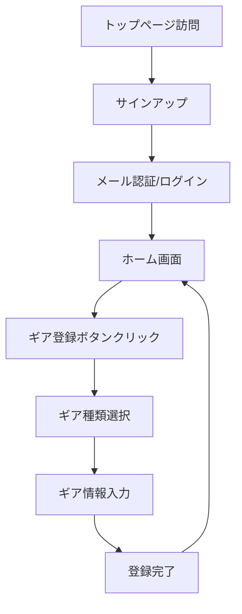
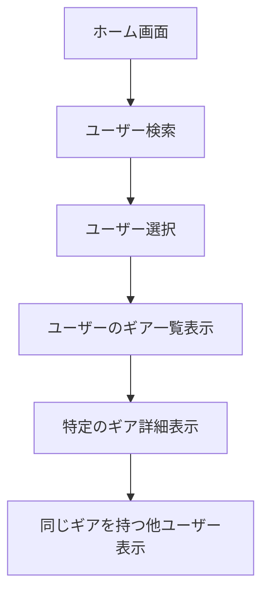

# peek_my_pack - カメラギア管理アプリ 仕様書

## 📸 アプリ概要

カメラのギア(機材)を管理し、他のユーザーと共有できるWebアプリケーション。
ユーザーは自分の所有するカメラ機材を登録・管理し、他のユーザーがどんなギアを持っているかを閲覧できる。

---

## 🎯 主な機能

> [!IMPORTANT]
> **MVP (最小機能製品) スコープ**
> - カメラ本体とレンズの登録・管理
> - 「欲しい」リスト機能
> - 検索機能
> - フィルタは将来的な拡張として保留
> - 画像アップロードは初期スコープ外(任意機能として将来実装)

### 1. ギア管理機能 (MVP)
- **登録可能なギア種類**
  - ✅ カメラ本体
  - ✅ レンズ
  - ⏳ フィルタ (将来実装)

- **基本操作**
  - ギアの登録(作成) - **Fixtureデータベースから選択**
  - ギアの編集
  - ギアの削除
  - ギア一覧表示
  - 「所有」「欲しい」の2つのステータス管理

### 2. 欲しいリスト機能 (MVP)
- 欲しいギアをリストに追加
- 欲しいリストの表示・管理
- 所有リストと欲しいリストの切り替え表示

### 3. 検索機能 (MVP)
- ギアの検索(メーカー、モデル名)
- ユーザーの検索
- フィルタリング機能

### 4. ソーシャル機能
- 他のユーザーのギアコレクションを閲覧
- 特定のギアを持っているユーザーの検索
- 特定のユーザーが他に持っているギアの表示

### 5. 認証機能
- ユーザー登録
- ログイン/ログアウト
- プロフィール管理

### 6. UI/UX
- ダークモード対応
- レスポンシブデザイン
- モノトーンでシンプル&モダンなデザイン

---

## 🛠️ 技術スタック

### フロントエンド
| 技術 | バージョン/詳細 |
|------|----------------|
| **Framework** | Next.js (最新版 - App Router) |
| **Language** | TypeScript |
| **Styling** | TailwindCSS |
| **State Management** | Jotai |
| **Lint/Format** | Biome |

### バックエンド
| 技術 | 詳細 |
|------|------|
| **Database** | Convex (リアルタイムドキュメントDB) |
| **Backend Functions** | Convex Queries/Mutations/Actions |
| **Authentication** | Clerk |

### 開発・デプロイ
| 項目 | 詳細 |
|------|------|
| **Package Manager** | pnpm |
| **Deployment** | Vercel |
| **Convex Hosting** | Convex Cloud |

---

## 📊 データモデル (Convex)

> [!NOTE]
> **Convex の特徴**
> - TypeScriptファーストのドキュメントデータベース
> - リアルタイムデータ同期がデフォルトで有効
> - スキーマ定義から自動的に型生成
> - サーバーレスで自動スケーリング

> [!IMPORTANT]
> **Fixtureデータ戦略**
> - `cameraMasters`と`lensMasters`テーブルに事前登録済みのカメラ・レンズデータを格納
> - ユーザーはこのマスターデータから選択して自分のコレクションに追加
> - 将来的にはユーザーが新しいギアをマスターデータに追加申請できる機能も検討

### User (ユーザー) - Clerkが管理
```typescript
// Clerkがユーザー情報を管理
// Convexでは userId (ClerkのID)を参照するのみ

### CameraMaster (カメラマスターデータ)
```typescript
{
  id: string
  manufacturer: string  // メーカー (Canon, Nikon, Sony等)
  model: string         // モデル名
  releaseYear?: number  // 発売年
  sensor?: string       // センサーサイズ (Full-frame, APS-C等)
  mount?: string        // マウント
  imageUrl?: string     // 公式画像URL
  createdAt: Date
  updatedAt: Date
}
```

### LensMaster (レンズマスターデータ)
```typescript
{
  id: string
  manufacturer: string  // メーカー
  model: string         // モデル名
  focalLength: string   // 焦点距離 (例: "24-70mm")
  aperture: string      // 開放F値 (例: "f/2.8")
  mount: string         // マウント (例: "EF", "Z", "E")
  releaseYear?: number  // 発売年
  imageUrl?: string     // 公式画像URL
  createdAt: Date
  updatedAt: Date
}
```

### UserCamera (ユーザーのカメラ)
```typescript
{
  id: string
  userId: string
  cameraMasterId: string  // CameraMasterへの参照
  status: 'owned' | 'wanted'  // 所有 or 欲しい
  purchaseDate?: Date     // 購入日(所有の場合)
  notes?: string          // メモ
  createdAt: Date
  updatedAt: Date
}
```

### UserLens (ユーザーのレンズ)
```typescript
{
  id: string
  userId: string
  lensMasterId: string    // LensMasterへの参照
  status: 'owned' | 'wanted'  // 所有 or 欲しい
  purchaseDate?: Date     // 購入日(所有の場合)
  notes?: string          // メモ
  createdAt: Date
  updatedAt: Date
}
```

### Filter (フィルタ) - 将来実装
```typescript
{
  id: string
  userId: string
  manufacturer: string
  model: string
  type?: string
  size?: string
  status: 'owned' | 'wanted'
  imageUrl?: string
  purchaseDate?: Date
  notes?: string
  createdAt: Date
  updatedAt: Date
}
```

---

## 🎨 主要画面

### 1. ホーム画面 (マイコレクション)
- 自分のギアコレクション一覧
- 「所有」「欲しい」タブ切り替え
- カテゴリ別タブ(カメラ/レンズ)
- 新規登録ボタン
- 検索バー

### 2. ギア登録画面
- マスターデータから検索・選択
- ステータス選択(所有/欲しい)
- メモ入力
- 購入日入力(所有の場合)

### 3. ギア詳細画面
- ギアの詳細情報表示
- 編集・削除ボタン
- 同じギアを持っている他のユーザー一覧
- 同じギアを欲しがっている他のユーザー一覧

### 4. 検索画面
- ギア検索(メーカー、モデル名)
- ユーザー検索
- フィルタリングオプション

### 5. 他ユーザーのプロフィール画面
- ユーザー情報
- そのユーザーのギアコレクション一覧
- 「所有」「欲しい」タブ切り替え

### 6. 認証画面
- ログイン
- サインアップ

---

## 🔄 主要なユーザーフロー

### 1. 新規ユーザー登録からギア登録まで


### 2. 他ユーザーのギアを閲覧


---

## 🎨 デザインシステム

### カラースキーム (モノトーン)
```css
/* Light Mode */
--background: 0 0% 100%        /* White */
--foreground: 0 0% 3.9%        /* Near Black */
--card: 0 0% 100%              /* White */
--card-foreground: 0 0% 3.9%   /* Near Black */
--primary: 0 0% 9%             /* Dark Gray */
--primary-foreground: 0 0% 98% /* Off White */
--secondary: 0 0% 96.1%        /* Light Gray */
--secondary-foreground: 0 0% 9%/* Dark Gray */
--muted: 0 0% 96.1%            /* Light Gray */
--muted-foreground: 0 0% 45.1% /* Medium Gray */
--accent: 0 0% 96.1%           /* Light Gray */
--accent-foreground: 0 0% 9%   /* Dark Gray */
--border: 0 0% 89.8%           /* Border Gray */

/* Dark Mode */
--background: 0 0% 3.9%        /* Near Black */
--foreground: 0 0% 98%         /* Off White */
--card: 0 0% 3.9%              /* Near Black */
--card-foreground: 0 0% 98%    /* Off White */
--primary: 0 0% 98%            /* Off White */
--primary-foreground: 0 0% 9%  /* Dark Gray */
--secondary: 0 0% 14.9%        /* Dark Gray */
--secondary-foreground: 0 0% 98%/* Off White */
--muted: 0 0% 14.9%            /* Dark Gray */
--muted-foreground: 0 0% 63.9% /* Medium Gray */
--accent: 0 0% 14.9%           /* Dark Gray */
--accent-foreground: 0 0% 98%  /* Off White */
--border: 0 0% 14.9%           /* Border Gray */
```

### タイポグラフィ
- **Primary Font**: Inter (Google Fonts)
- **Monospace Font**: JetBrains Mono (コード・技術情報用)

### デザイン原則
- **ミニマリズム**: 余計な装飾を排除
- **モダン**: 最新のUIトレンドを取り入れる
- **高コントラスト**: 可読性を重視
- **滑らかなアニメーション**: マイクロインタラクション
- **レスポンシブ**: モバイルファースト

---

## 📝 実装ロードマップ

### Phase 1: プロジェクトセットアップ
- [x] 仕様書の作成
- [x] Next.jsプロジェクトの初期化 (pnpm)
- [ ] Convexのセットアップ
  - [ ] Convexプロジェクトの作成
  - [ ] `convex` パッケージのインストール
  - [ ] ConvexとNext.jsの連携設定
- [ ] Clerkのセットアップ
  - [ ] Clerkアカウント作成
  - [ ] `@clerk/nextjs` パッケージのインストール
  - [ ] ClerkとConvexの連携設定
- [ ] 必要なパッケージのインストール
  - [ ] Jotai (状態管理)
  - [ ] TailwindCSS関連
- [ ] Biomeの設定 (代わりにESLintが設定済み)
- [ ] TailwindCSSの設定 (モノトーンテーマ)

### Phase 2: Convexデータベース設計
- [ ] Convexスキーマ定義
  - [ ] cameraMasters
  - [ ] lensMasters
  - [ ] userCameras
  - [ ] userLenses
- [ ] Fixtureデータの準備 (カメラ・レンズのマスターデータ)
- [ ] Fixtureデータのシード
- [ ] Convex関数の作成
  - [ ] Queries (データ取得)
  - [ ] Mutations (データ更新)

### Phase 3: 認証実装 (Clerk)
- [ ] Clerkの設定
- [ ] サインアップ・ログイン画面
- [ ] ClerkとConvexの認証連携
- [ ] プロフィール管理

### Phase 4: MVP機能実装
- [ ] ホーム画面 (マイコレクション)
- [ ] ギア登録機能 (マスターデータから選択)
- [ ] 「所有」「欲しい」ステータス管理
- [ ] ギア詳細画面
- [ ] ギア編集・削除機能
- [ ] 検索機能 (ギア・ユーザー)
- [ ] 他ユーザーのプロフィール表示
- [ ] リアルタイム更新の実装

### Phase 5: UI/UX改善
- [ ] ダークモード実装
- [ ] レスポンシブ対応
- [ ] アニメーション・トランジション
- [ ] ローディング状態
- [ ] エラーハンドリング

### Phase 6: テスト・デプロイ
- [ ] 動作確認
- [ ] Vercelへのデプロイ
- [ ] Convexの本番環境設定
- [ ] 本番環境でのテスト

### 将来的な拡張機能
- [ ] フィルタの登録・管理
- [ ] 画像アップロード機能 (Convex File Storage)
- [ ] いいね・お気に入り機能
- [ ] コメント機能
- [ ] ユーザーによるマスターデータ追加申請
- [ ] タグ・カテゴリ機能
- [ ] 統計・分析機能

---

## 🔥 Convexの主なメリット

1. **リアルタイム同期がデフォルト**
   - データ変更時に自動的にクライアントが更新される
   - WebSocketの設定不要

2. **TypeScriptファースト**
   - スキーマから自動的に型生成
   - エンドツーエンドの型安全性

3. **サーバーレスアーキテクチャ**
   - 自動スケーリング
   - インフラ管理不要

4. **開発者体験**
   - シンプルAPI
   - Reactとのシームレスな統合
   - ローカル開発環境が充実

---

## 🔐 Clerkの主なメリット

1. **簡単な統合**
   - Next.jsとのネイティブ統合
   - 数分で認証機能を追加可能

2. **豊富なUIコンポーネント**
   - プリビルトのサインイン/サインアップUI
   - カスタマイズ可能

3. **セキュリティ**
   - MFA対応
   - OAuthプロバイダー対応 (Google, GitHub等)
   - セッション管理

4. **Convexとの連携**
   - ClerkのJWTをConvexで検証
   - シームレスな認証フロー
